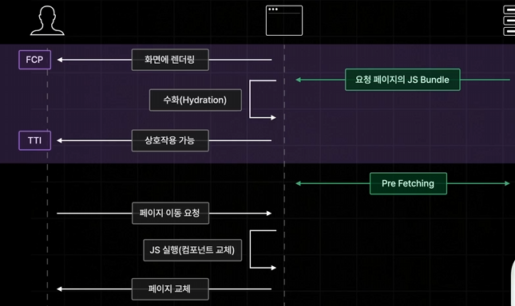

# Next pre-fetching

페이지를 미리 불러온다.
사용자가 현재 보고 있는 페이지에서 Link되어있는 페이지들을 미리 불러와 놓는 기능
-> 이동할 가능성이 있는 모든 페이지들을 미리 불러놓는다.

현재 페이지에서 필요한 데이터를 미리 불러와 놓음으로서 이동을 매우 빠른 속도로 지체없이 이동하기 위함임

## 클라이언트사이드 렌더링인데 pre-fectching이 필요한 이유

page 별로 미리 spliting 해두기 때문이다.

브라우저가 직접 리액트 앱을 실행시켜서 필요한 컴포넌트를 교체하는 방식, 즉 클라이언트사이드렌더링 이라는 방식으로 처리를 하게 된다.

사전 렌더링 과정에서 모든 페이지에 필요한 자바스크립트 코드가 전달되는게 아니라, 현재 페이지에 해당하는 자바스크립트 코드만 전달된다. 이렇게 동작하는 이유는 전달되는 자바스크립트 코드의 양을 줄이기 위함이다.

만약에 모든 페이지에 들어갈 코드들을 전달해주면 한 번에 전달해주는 파일의 용량이 매우 커지게 된다. 그렇게되면 전달되는 용량이 커져 다운로드 속도도 브라우저에서 느려지게 된다. -> Javascript 코드들을 실행해서 렌더링되어있는 HTML과 연결하는 Hydration 과정도 오래 걸리게 된다 -> 앱에 상호작용할 수 있는 시간인 TTI가 최종적으로 느려지게 된다.

그런데 지금 Next의 방식처럼 필요한 자바스크립트 파일만 보내주게 되면,
하이드레이션은 빨라질 수 있지만 오히려 페이지 이동은 느려지고 조금은 비효율적이게 된다. 이 부분을 해결하기 위해 pre-fetching 기능이 있는 것.

pre-fetching : 현재 사용자가 보고 있는, 웹 페이지에서 이동할 수 있는 가능성이 있는 모든 페이지들에 연결된 자바스크립트 코드를 미리 불러와놓는 과정

-> 이렇게 되면 이동할 때 추가적인 데이터를 서버에게 요청할 필요가 없어져, 기존처럼 클라이언트 사이드 렌더링 방식의 장점대로 굉장히 빠른 속도로 이동시킬 수 있게 되는 것이다.

즉, Next.js 의 사전 렌더링은 초기 접속시 모든 페이지에 대한 자바스크립트 파일이 전달되는게 아니었다. 현재 접속 요청이 발생한 페이지에 해당하는 자바스크립트 번들 파일만 전달이 되고,
페이지에 접속한 이후에는 pre-fetching이라는 기능을 통해서 현재 페이지에서 이동할 수 있는 모든 페이지들에 대한 자바스크립트 코드를 사전에 미리 다 불러와 놓게 된다.

-> 하이드레이션을 더 빠르게 처리할 수 있게 해주고, pre-fetching을 통해서 초기 접속 요청 이후에 페이지 이동까지 빠르게 처리해 줄 수 있게 되는 것이다.
