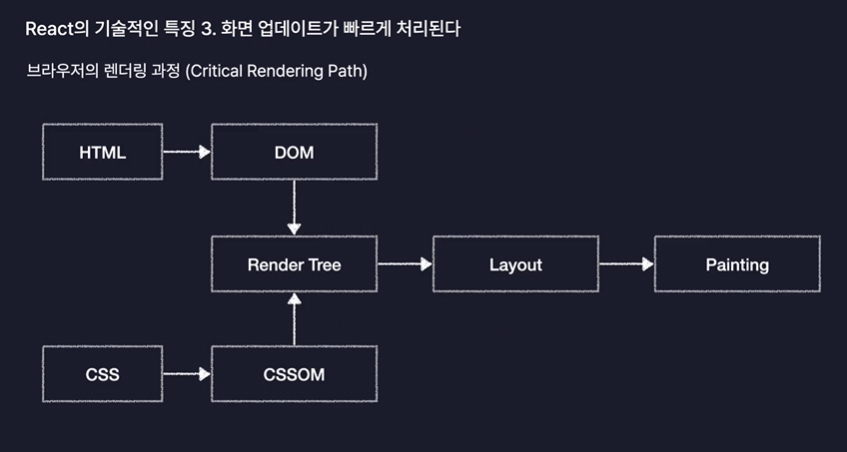
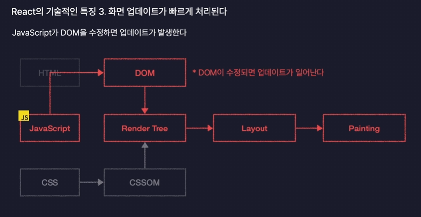

[리액트가 가지는 핵심 3가지 특징]

## 1. 컴포넌트를 기반으로 UI를 표현한다. 
공통으로 쓰이는 헤더 같은 영역의 경우, 모듈화 하지 않으면 같은 코드를 여러번 작성해야한다. 
늘어날수록 코드를 수정하고 유지보수하는데 비용이 커진다. 
리액트는 페이지의 모든 요소들을 컴포넌트라는 단위로 모듈화해서 개발하기 때문에 헤더처럼 여러 페이지에서 공통으로 사용되는 컴포넌트를 만들고, 이 컴포넌트를 불러와서 사용하도록 하면, 애초에 중복 코드가 발생하지 않는다. 

:happy

## 2. 화면 업데이트 구현이 쉽다.
리액트에서는 업데이트 구현이 쉽다. 이는 리액트는 선언형 프로그래밍이라는 방식으로 동작하기 때문이다. 선언형 프로그래밍이란, 불필요한 과정은 생략하고, 내가 이루고자 하는 목적만 간결히 명시하는 방법을 의미한다. 
음식을 주문하는 것과 비슷하다. 선언형 프로그래밍의 반대는 명령형 프로그래밍이다. 명령형 프로그래밍은 목적을 이루기 위한 일련의 모든 과정을 하나하나 다 설명하는 방식을 말한다. 목적을 이루기 위한 모든 과정을 다 설명하기 때문에 코드가 비교적 길고 복잡해질 수 있다. 리액트 없이 자바스크립트로만 구현한다고 하면, 특별한 도구를 추가로 사용하지 않는 이상은 보통 명령형 프로그래밍 방식으로 모든 기능을 다 구현해야 하기 때문에 코드가 길고 복잡해질 수 있다. 

### 그래서 원리가무엇이냐,
리액트는 각각의 컴포넌트로 나누어 개발하게 된다. 이때 각각의 컴포넌트는 state라는 현재 상태를 저장하는 특수한 변수를 저장할 수 있다. 이 state의 값이 바뀌면 컴포넌트가 바뀐 state 값에 따라 각각 다른 UI를 화면에 렌더링하도록 설정해줄 수 있다. 이때 렌더링이란 그냥 웹 페이지 화면에 UI 요소를 그려내는 것을 의미한다. 따라서 화면의 업데이트가 필요할 때 컴포넌트가 가지고 있는 state 라는 변수의 값만 바꾸면 자동으로 다른 버전의 UI를 렌더링할 수 있도록 설정할 수 있다. 
-> 명령형 방식으로 직접 정의할 필요 없이 그냥 특정 변수의 값만 바꿔주면 선언형 방식으로 화면이 업데이트 되도록 처리할 수 있다는 의미이다. 

## 3. 화면 업데이트가 빠르게 처리된다.

### 브라우저 동작의 원리를 먼저 알아야한다. 

브라우저는 우리가 HTML과 CSS로 작성한 웹 페이지를 여러 단계의 과정을 거쳐서 화면에 렌더링 시켜주게 된다. 이때 브라우저의 전체 렌더링 과정을 
브라우저 렌더링 과정에서 꼭 반드시 거쳐야하는 중요한 경로다. 라는 의미에서 
Critical Rendering Path라고도 부른다. 
첫번째 단계에서는 HTML과 CSS를 각각 DOM 이라는 것과 CSS Object Model이라는 것으로 변환하게 된다. 
DOM이라는 것은 코드를 브라우저가 자기가 더 이해하기쉬운 방식으로 변환한 형태의 객체를 말한다. HTML 문서를 일종의 객체 모델로 변환한거다. 라고 해서 Document Object Model, DOM 이라고 한다. 

CSS Object Model도 DOM과 비슷한 것이라고 생각하면 된다. CSS Object Model또한 CSS 코드를 브라우저가 자기가 더 이해하기 쉬운 형태로 변환한것을 말한다. 

각각의 HTML과 CSS를 오브젝트 모델로 변환하고 나면, DOM과 CSS Object Model을 합쳐서 Render Tree라는 것을 만들게 된다. 
이 렌더트리는 웹 페이지의 청사진 또는 웹 페이지의 설계 정도의 역할을 한다.
DOM에는 우리가 HTML로 표현한 요소들의 위치나 배치 모양등에 관한 정보가 있을 것이고, CSSOM에는 CSS 로 표현한 요소들의 스타일과 관련된 모든 정보가 있을 것이다. 
그렇기 때문에 이 두개를 합쳐서 만든 렌더 트리에는 화면에 나타나야 되는, 즉 화면에 렌더링 되어야하는 요소들의 모든 정보가 다 포함이 되어있다. 

이렇게 렌더 트리를 만들게 되면 다음으로는 레이아웃 작업을 수행한다. 웹 페이지라는 공간 안에 렌더 트리에 포함되있는 요소들의 배치를 잡아보는 과정이다.(방 구조 배치와 똑같이 생각하면 됨) 헤더는 어디에 두고, 바디는 어디에 두고... 등등 이런 식으로 위치들을 계산해서 배치를 잡는 작업을 레이아웃이라고 한다. 

이렇게 요소들의 레이아웃을 잡고 나면 마지막으로 Painting이라는 작업을 진행한다. 이 페인팅은 이름에서 알 수 있듯이 실제로 화면에 그려내는 과정이다. 그래서 이 과정을 거치게 되면 웹 페이지가 눈 앞에 실제로 나타나게 된다. 

### 이때, 화면의 업데이트는 어떻게 나타날까?
화면의 업데이트는 javascript가 DOM을 수정하게 되면 발생한다. DOM이 수정되면 브라우저는 이 Critical Rendering Path의 전체 단계를 다시 진행한다. 그럼으로써 화면에 그려지는 렌더링 요소들이 변경되면서 업데이트가 실제로 이루어지게 된다. 
그런데 문제는 layout, painting의 과정은 꽤나 오래 걸리는 과정이다. 그렇기 때문에 DOM이 수정되어서 Layout이 다시 잡는 과정을 reflow라고 하고, painting이 다시 진행되는 과정을 Repaint라고 부른다. 이렇게 별도로 부르는 이름이 있을 정도로 두 과정이 오래 걸리는 것이다. 
그렇기 때문에 자바스크립트로 DOM을 순식간에 3000번을 수정하게 되면 렌더 트리 이후의 과정, reflow, repaint의 과정을 총 3000번 진행하되된다. 그러면 당연히 성능 측면에서 좋지 못하다. (* Vue는 어떻게 하는대요?)

프레임워크 없이 innerHTML로 3000번을 넣는 과정은 reflow, repaint가 3000번 일어나는 과정과 같다. 이 과정을 렌더링할 html 코드로 만들고, 한번만 렌더링하게 된다면 유의미한 성능 개선이 일어나게 된다. 

React는 동시에 발생한 업데이트들을 모아서 DOM 수정 횟수를 최소화 하는 이 작업을 딱히 신경쓰지 않아도 자동으로 처리해준다. 
그렇기 때문에 우리가 리액트에서 아무리 많은 업데이트를 동시에 발생시킨다고 하더라도, 대부분의 상황에 충분히 빠른 속도로 업데이트를 구현할 수 있도록 도와준다. 

### 왜냐면, React 의 Virtual DOM 기능 때문이다. 
Virtual DOM 이라는건 실제 브라우저가 렌더링하는 DOM을 Javascript 객체로 카피해 놓은 것이라고 생각하면 된다. 그래서 리액트에서는 Virtual DOM을 이용해서 업데이트가 발생하면 실제 DOM을 바로 수정하는게 아니라 가상 DOM을 먼저 수정하도록 만든다. 그리고 동시에 여러곳에서 업데이트가 발생하면 바로 DOM에 적용하는 것이 아니라 Virtual DOM에 적용을 해본다. 그러고 나서 동시에 발생한 업데이트들이 다 모였다라고 하면, 이렇게 모인 업데이트들을 한 방에 DOM에 반영을 해준다. 그럼으로써 이 가상 DOM이 일종의 버퍼 역할, 일종의 업데이트를 한 번에 모아두는 장소의 역할을 해서 동시에 아무리 많은 업데이트가 발생한다고 하더라도 최소한의 수정 횟수로 DOM이 수정이된다. 
그래서 결론적으로 좋은 업데이트 성능을 어느정도 보장해준다고 보는 것이다. 

---

