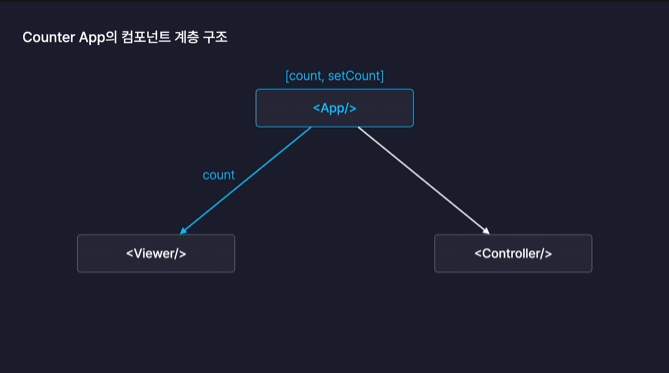

# State

- state 어떠한 사물이 현재 가지고 있는 모양이나 형태를 정의하는 값이면서, 동시에 동적으로 변할 수 있는 값이기도 하다.
- 리액트의 컴포넌트는 모두 다 자신의 형태나 모양을 정의하는 state를 가질 수 있다.
- 이 state를 가지고 상태에 따라서 각각 다른 UI를 화면에 렌더링할 수 있다.
- 컴포넌트가 다시 렌더링 되는 상황을 re-render, rerendering 이라고 한다.
- 컴포넌트 안에서 여러개의 state를 가질 수도 있다.

```
const [state, setState] = useState(0)
```

- useState의 첫번째 요소는 값을 가지고, 두번째 요소는 값을 변경할 함수를 가진다.
- 상태를 변화시키는 이 함수를 상태 변화함수라고 한다.

## state에 따른 re-rendering

- state 따라서 UI가 달라지게 되면 컴포넌트는 업데이트 된 상태로 화면에 다시 그려지게 된다. 이 과정을 리렌더링 이라고 한다. 즉, 컴포넌트가 return을 다시 한다. 이때 변경된 컴포넌트로 화면을 다시 그린다.

## 그냥 let, const 변수와 다른 점 ?

왜 굳이 react에서는 useState를 사용해서 값을 변경해주는걸까?
기존의 let으로 선언한 변수라면 값이 변할 수는 있지만, 화면을 다시 그려주지는 않는다. 즉, 클릭을 해도 아무런 변화가 일어나지 않는다는것.
react 컴포넌트는 일반 변수가 아닌 state 값이 변화할때만 화면을 다시 그리기 때문이다.

### state를 props로 전달하기

자식 컴포넌트는 부모로부터 받는 props의 값이 바뀌면 리렌더링 된다.
리액트 컴포넌트는 자신이 갖고 있는 스테이트가 변경되지 않더라도 부모로부터 받는 props의 값이 변경되면 다시 리렌더링 된다.

[re-rendering이 발생하는 세 가지 상황]

- 자신이 관리하는 state 값이 변경될 때

- 제공받는 props의 값이 변경될 때

- 부모 컴포넌트가 리렌더링 될 때

불필요하게 리렌더링을 자주 하게 되면 성능 저하의 원인이 될 수 있다. 이를 방지하기 위해 관련이 없는 state는 따로 분리해주는 것이 좋다.

### 여러개의 state를 관리하기

```
const [name, setName] = useState("")
const [country, setCountry] = useState("")
// 이렇게 반복되는 구조를 하나로 묶어서 관리할 수 있다.
const [input, setInput] = useState({
    name : "",
    country : ""
})
//setName은 이렇게 개선할 수 있음
const onChangeName = (e)=> {
    setInput({
        ...input,
        name : e.target.value
    })
}
이 함수를 범용적으로 바꾼다면
const onChangeInput = (e)=> {
    setInput({
        ...input,
        [e.target.name] : e.target.value
    })
}
input 엘리먼트의 name 속성을 가지고 값을 할당해주는 구조로 바꿀 수 있다.
[변수의이름] 이런식으로 선언함은 프로퍼티의 이름을 이렇게 지정해주겠다는 의미를 가짐.
```

이렇게하면 여러개의 input, 여러 개의 change 함수를 onChange, input으로 받음으로써 한번에 처리할 수 있다. 이런식으로 통합 이벤트로 관리할 수 있다.

### 자식 컴포넌트 간에는 props를 주고 받을 수 없다.

자식 컴포넌트가 같은 값을 바라봐야한다면, 부모 컴포넌트에서 값을 전달하고 이벤트 핸들러를 주고 받으며 값을 공유할 수 있다. props는 부모-자식관계에서만 주고 받을 수 있는 단방향 데이터 흐름을 하고 있기 때문에 자식-자식간에는 주고 받을 수 없다.


```
// 부모 컴포넌트에서
const [count, setCount] = useState(0)
const onClickFunction = (value) => {
    setCount(count+value)
}
...
<App>
<Viewer count={count}/>
<Controller onClickButton={onClickFuntion}/>
</App>
....
// Controller.jsx
const Controller = (onClickButton)=> {
    <button onClick={()=> {onClickButton(-1)}}}>-1</button>
}
```

props로 controller에 값을 변경하는 메서드를 전달해주고,
자식 컴포넌트에서는 click 이벤트 발생시 계산에 사용할 value를 매개변수로 전달하여 카운트를 업데이트한다.

- 컴포넌트는 부모와 자식 관계로 계층 구조를 형성한다.
- 특정 컴포넌트가 다른 컴포넌트에게 데이터를 전달하려면 반드시 두 컴포넌트는 서로 부모-자식 관계를 가지고 있어야한다.
- 하나의 state를 여러 컴포넌트에서 관리하게 될 경우, 이 state는 반드시 부모 컴포넌트에서 만들어야한다.
- 이렇게 state를 계층 구조상에서 위로 끌어올려서 그 아래에 있는 컴포넌트들이 모두 공유할 수 있도록 만드는 방법을 State Lifring 이라고 한다.
- props라는 기능은 결국 부모에서 자식으로, 단방향으로만 데이터를 전달할 수 있다.
- 그렇기 때문에 데이터의 원천인 state를 어떤 컴포넌트에 위치 시킬 것인지 고민하고 결정해야한다는 것이다.
